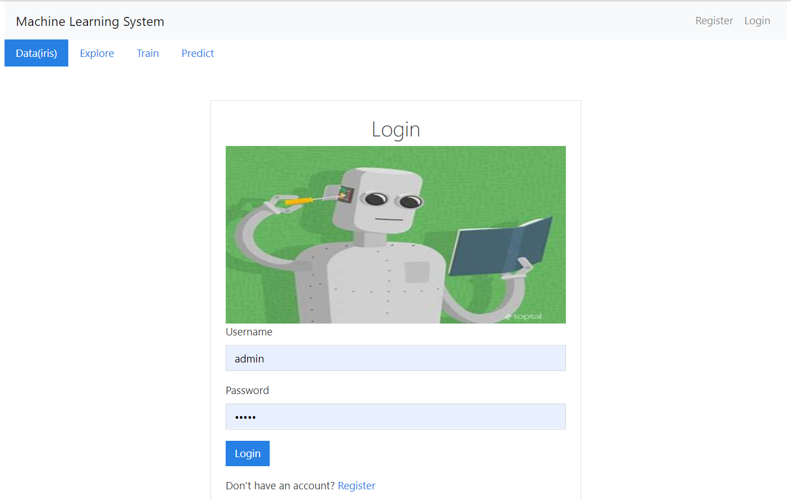
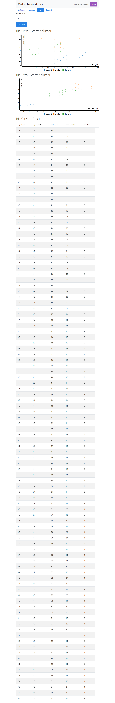
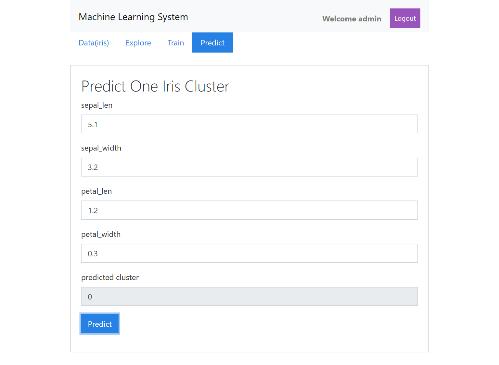

# Machine Learning System

## introduction

This project is a full stack Django/React/Redux app that uses token based authentication with Knox.

Then I add Machine Learning features for demostrate the full workflow of the data mining, including the four stage corresponding to four pages:
1. data management
2. data explore
3. model train
4. prediction

The data set is the classic iris data, which is only for demo, and this project is from my interest. so you can reference, but the quality is not assured.

## features

* authentication functions
> login from login page
> register your account
> logout from inner page

* data management
> input iris items
> edit iris items
> delete iris items

* data explore
> inspect attribute distribution through histogram
> inspect sepal distribution through scatter graph
> inspect petal distribution through scatter graph

* model train
> input cluster number
> train a cluster model using sklearn-kmeans library
> inspect cluster result through sepal and petal scatter

* prediction
> input iris sepal and petal attributes
> predict iris cluster

## technology stack


category | name | comment
---------|----------|---------
 frontend | reactjs | frontend framework
 frontend | redux | state management
 frontend | react-C3JS | D3 based graph tool
 frontend | react-bootstrap | style component library
 frontend | data-ui | react data visualization tool
 backend | django | backend framework
 backend | django-rest-knox | authentication library
 backend | djangorestframework | restful framework
 backend | sklearn | machine learning tool

## Quick Start

```bash
# Install dependencies
cd ./frontend
npm install

# Build for production
npm run build


# Install dependencies
cd ../backend
pip3 install pipenv
pipenv install

# Serve API on localhost:8000
pipenv run python manage.py runserver
```

### deploy on production environment

#### run on wsgi server(uwsgi)

```
pipenv run uwsgi --http :9090 --wsgi-file config/wsgi.py --check-static ../frontend/dist/
```

#### run on nginx + uwsgi

there are two points needed to modified:
(1) the root path of default file
root /root/win10/mine/machine_learning_system/frontend/dist/;
(2) the user role of nginx.conf file
user root;

```
apt update
apt install nginx

pipenv run uwsgi --socket :9090 --wsgi-file config/wsgi.py

cp -f ./config/default /etc/nginx/sites-available/default
cp -f ./config/nginx.conf /etc/nginx/nginx.conf
nginx&

```

## snapshot

### login page


### model train page


### prediction page



