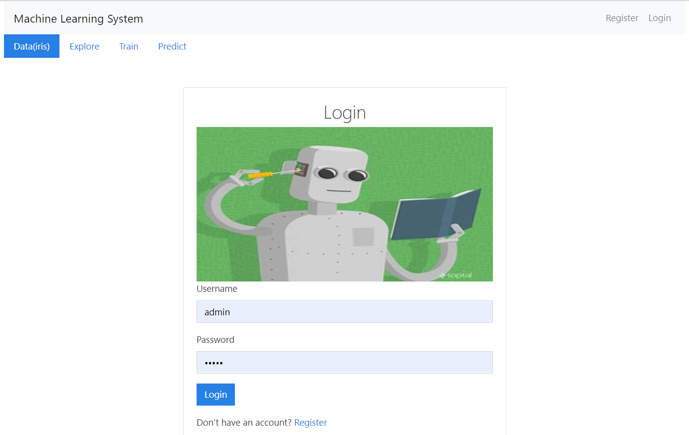
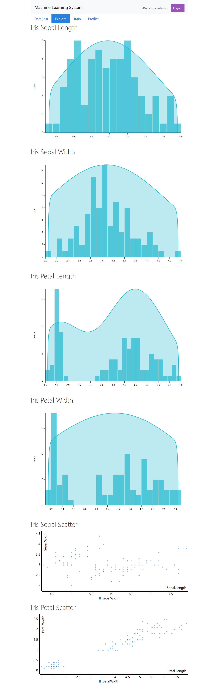
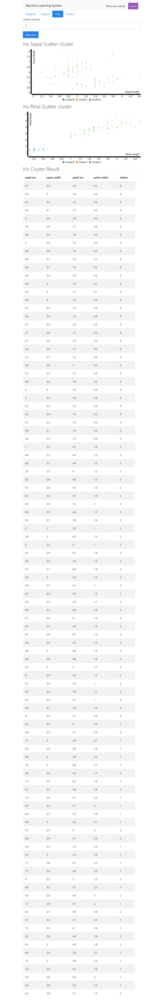
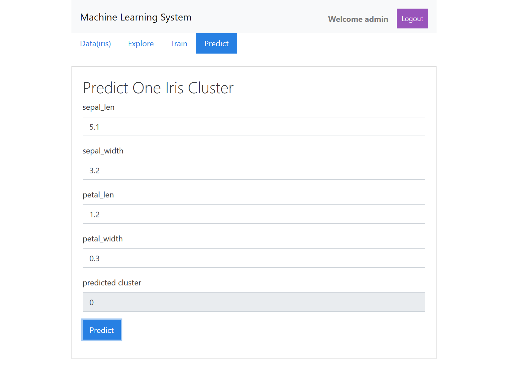
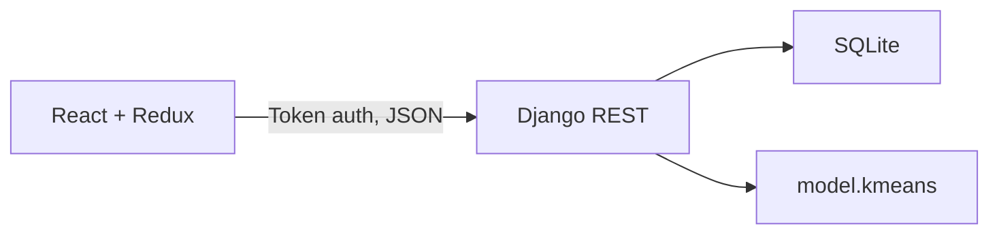

# Machine Learning System

Full-stack demo of a data-product loop: manage Iris records, explore them, train a K-Means model, and predict with Django REST and React.

The dataset is the classic Iris set. The point of the project is the product path, not a new algorithm. Register an account, then move through four pages. Each page calls a Django REST API. Training writes a `model.kmeans` file; prediction reads that file back.

## Screenshots

| Login | Data management |
| --- | --- |
|  |  |

| Explore | Train |
| --- | --- |
|  |  |



## What it demonstrates

1. **Data management.** Create, edit, and delete Iris rows (sepal length, sepal width, petal length, petal width, optional category).
2. **Explore.** Histograms of each attribute, plus scatter plots for sepal and petal pairs.
3. **Train.** Choose a cluster count, fit `sklearn.cluster.KMeans` on the stored rows, and plot the assigned clusters.
4. **Predict.** Submit four measurements and get the cluster id from the saved model.

Authentication covers register, login, and logout. Iris list APIs require a Knox token. The React app keeps that token in `localStorage` and sends `Authorization: Token <token>` on later requests.

## Architecture

The browser loads a React single-page app built by webpack. Django serves `frontend/dist` and the REST API from the same origin, so the UI calls `/api/...` without a separate CORS setup. Routes use a hash router (`/#/login`, `/#/explore`, `/#/train`, `/#/predict`).


```mermaid
flowchart LR
  browser["React + Redux"] -->|"Token auth, JSON"| api["Django REST"]
  api --> db["SQLite"]
  api --> model["model.kmeans"]
```

| Piece | Choice | Why it is here |
| --- | --- | --- |
| UI | React 16, React Router, Redux, redux-thunk | Page state and auth live in one store; thunks call the API |
| Charts | react-c3js, @data-ui/histogram | Scatter plots and attribute histograms |
| UI kit | react-bootstrap | Layout and forms |
| API | Django 2.1, Django REST framework | CRUD viewset plus train and predict endpoints |
| Auth | django-rest-knox | Token login without session cookies for the SPA |
| Model | scikit-learn K-Means, joblib | Fit in the request, persist one file, load it for prediction |
| Database | SQLite | No extra service for a local demo |
| Production shape | Nginx static files + uWSGI | Nginx serves `frontend/dist`; `/api/` goes to uWSGI |

Main API routes:

| Method | Path | Role |
| --- | --- | --- |
| POST | `/api/auth/register` | Create a user and return a token |
| POST | `/api/auth/login_extend` | Login and return a token |
| POST | `/api/auth/logout/` | Invalidate the token |
| GET | `/api/auth/user` | Current user |
| GET, POST | `/api/iris/` | List or create rows |
| PUT, DELETE | `/api/iris/<id>/` | Update or delete a row |
| POST | `/api/train` | Fit K-Means and return labeled points |
| POST | `/api/predict` | Score one row against `model.kmeans` |

## Quick start

Prerequisites: Python 3.7, Node.js with npm, and [pipenv](https://pipenv.pypa.io/). The backend `Pipfile` pins Python 3.7 and Django 2.1.

Build the frontend first. Django reads templates and static files from `frontend/dist`.

```bash
cd frontend
npm install
npm run build
```

Then migrate and start the API. `runserver` also serves the built page.

```bash
cd ../backend
pipenv install
pipenv run python manage.py migrate
pipenv run python manage.py runserver
```

Open [http://127.0.0.1:8000](http://127.0.0.1:8000). Register a user, then add a few Iris rows on the data page before Explore or Train. Empty tables produce empty charts. Example rows:

| sepal length | sepal width | petal length | petal width |
| --- | --- | --- | --- |
| 5.1 | 3.5 | 1.4 | 0.2 |
| 7.0 | 3.2 | 4.7 | 1.4 |
| 6.3 | 3.3 | 6.0 | 2.5 |

Train once before Predict. Prediction loads `backend/model.kmeans`, which appears only after a successful train.

## Deployment sketch

Two layouts are in the repo. Both expect `npm run build` to have produced `frontend/dist`.

**uWSGI only.** HTTP and the built assets come from one process:

```bash
cd backend
pipenv run uwsgi --http :9090 --wsgi-file config/wsgi.py --check-static ../frontend/dist/
```

**Nginx in front of uWSGI.** Nginx serves `frontend/dist`. Requests under `/api/` go to a uWSGI socket on port 9090.

```bash
cd backend
pipenv run uwsgi --socket :9090 --wsgi-file config/wsgi.py
```

`config/default` is an example server block. Set `root` to the absolute path of `frontend/dist` on that machine. The Nginx user in `config/nginx.conf` must be able to read that directory. Copy the files into the Nginx config paths you use, then reload Nginx. Do not run Nginx as root just to make a demo path readable.

## Limits

This is a demo of the workflow.

- Iris is a toy set. Cluster labels are not the species names, and there is no silhouette score or other evaluation.
- The model is one local file. Two workers, or a train on another host, will not share it. `sklearn.externals.joblib` is the old import path; current scikit-learn exposes `joblib` directly.
- Train and predict endpoints do not set `IsAuthenticated`, unlike the Iris viewset.
- The stack is the Django 2.1 / React 16 era. Dependency pins are for reproducing this demo, not a current production baseline.
- `config/settings.py` ships with `DEBUG = True` and a development `SECRET_KEY`.

## License

ISC
